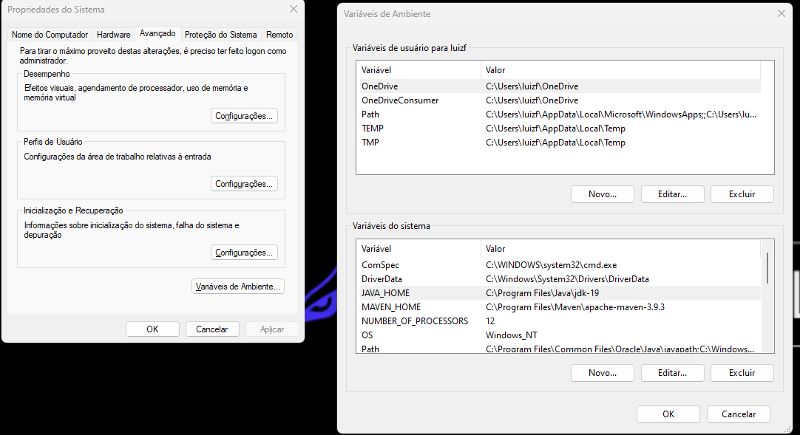
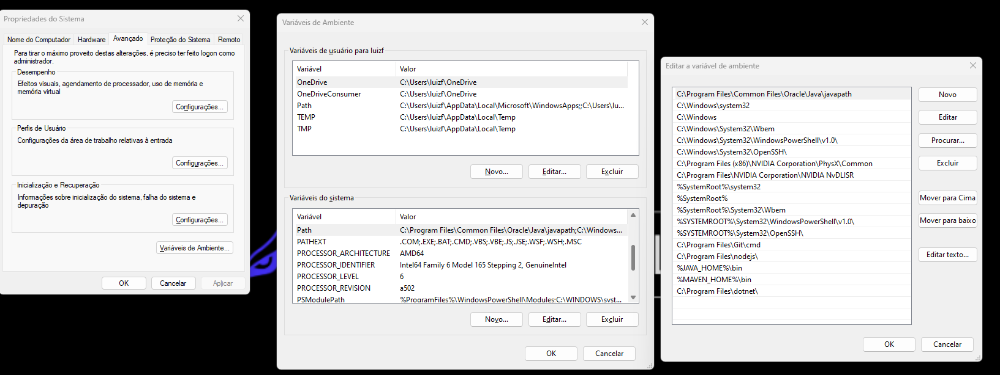

# Instalação Spring boot

Manual baseado na aula de <a href="https://www.youtube.com/watch?v=WHJvBUADvCE&list=PLiXotHlANc8ptwP6wajo73OZo9Nh5i597&index=2&ab_channel=Lucas%C3%82ngelo"> instalação do spring boot</a> do <a href="https://www.youtube.com/playlist?list=PLiXotHlANc8ptwP6wajo73OZo9Nh5i597"> Curso API RESTful com Spring Boot 2022 (Java Web) </a>

### Instalar o JAVA:

- <a href="https://www.java.com/pt-BR/download/">Download JAVA</a>
- Configurar variáveis de ambiente do sistema

  - Painel de Controle -> Variáveis de Ambiente
  - JAVA_HOME:

    - C:\Program Files\Java\jdk-19
      

  - Path:
    - %JAVA_HOME%\bin
      

## Instalar MAVEN:

Maven é uma ferramenta de automação de construção (build) amplamente utilizada no universo Java e em projetos Spring Boot. Ela é projetada para simplificar o processo de gerenciamento de dependências, compilação, empacotamento e distribuição de projetos Java. Aqui estão os principais aspectos do Maven:

Gerenciamento de Dependências: Uma das características mais poderosas do Maven é o seu sistema de gerenciamento de dependências. Com o Maven, você pode definir as bibliotecas e dependências que o seu projeto Java precisa e o Maven automaticamente cuidará de baixar essas dependências, bem como suas dependências transitivas (ou seja, dependências das dependências).

Estrutura de Diretórios Padrão: O Maven define uma estrutura de diretórios padrão para projetos Java, o que facilita a organização do código-fonte, dos recursos e dos artefatos gerados. Isso ajuda a manter a consistência em diferentes projetos.

Ciclo de Vida de Build: O Maven define um ciclo de vida de build comum que consiste em fases como compilação, teste, empacotamento (geração de JAR, WAR, etc.) e distribuição. Você pode executar essas fases individualmente ou em sequência, simplificando o processo de construção de um projeto.

Plugins: O Maven é altamente extensível por meio de plugins. Existem plugins Maven para uma ampla variedade de tarefas, desde a integração com ferramentas de teste até a implantação em servidores de aplicação. Os desenvolvedores podem configurar esses plugins no arquivo de configuração pom.xml (Project Object Model).

Repositórios: O Maven usa repositórios remotos e locais para armazenar e recuperar bibliotecas e dependências. Existem repositórios públicos amplamente utilizados, como o Maven Central, onde você pode encontrar uma grande variedade de bibliotecas Java.

No contexto do Spring Boot, o Maven é frequentemente usado como a ferramenta de construção padrão para gerenciar as dependências e compilar aplicativos Spring Boot. O Spring Boot fornece modelos de projeto Maven prontos para uso que simplificam a configuração inicial de um projeto Spring Boot.

Em resumo, o Maven é uma ferramenta essencial no ecossistema Java e Spring Boot que ajuda os desenvolvedores a automatizar tarefas de construção, gerenciamento de dependências e distribuição de projetos, facilitando o desenvolvimento de aplicativos Java e Spring Boot de forma eficiente e consistente.

Apache Maven

- <a heref="https://maven.apache.org/download.cgi">Download MAVEN</a>
- Configurar variáveis de ambiente do sistema
  - MAVEN_HOME:
    - C:/Program Files/Maven/apache-maven-3.8.5
      
  - Path:
    - %MAVEN_HOME%\bin
      
